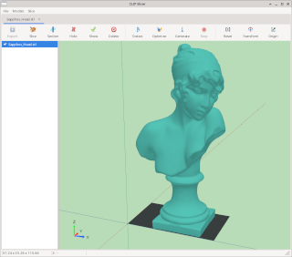
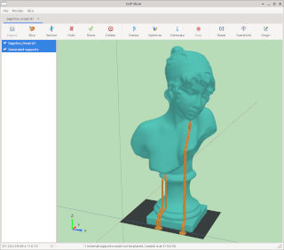

<!-- SPDX-License-Identifier: CC0-1.0 -->

# CLIP Slicer

CLIP Slicer is a model-preparation tool for 3D printing, with an emphasis on
slice inspection and support generation. It grew out of my experience with
models that developed printing artifacts because of defects in STL geometry or
insufficient support.

CLIP Slicer currently accepts 3D models in
[STL format](https://en.wikipedia.org/wiki/STL_(file_format)) and exports slices
in [Common Layer Interface (CLI) format](https://www.hmilch.net/downloads/cli_format.html).
Before export, the Section tool can inspect
the contours produced at the configured layer thickness and first-layer offset.
Z-axis sections correspond to the layers produced by normal slicing; X- and
Y-axis sections are inspection views and are not exported as layers.

Support generation consists of three main tools:

- **Detect** visualizes areas with insufficient support.
- **Optimize** searches for a model orientation that minimizes the total area of
  unsupported surfaces.
- **Generate** produces support structures that connect unsupported surfaces to
  the build platform.

The core application code is structured as a reusable C++17 library that can be
integrated into other projects. A small command-line slicer is also provided for
batch processing.

<!-- RPM-EXCLUDE-BEGIN: screenshots are retained in the source README only. -->
The following screenshots show the model view and generated supports:




The model shown is the traditional [Bust of Sappho](https://www.thingiverse.com/thing:14565)
from Thingiverse (thing 14565).
<!-- RPM-EXCLUDE-END -->

## Build and test

### Linux

The command-line target depends only on a C++17 compiler and CMake. The GUI target additionally
requires development packages for wxWidgets 3.2, OpenGL, GLU, and libepoxy.

Build the command-line slicer only:

```sh
cmake -S . -B build-cli \
  -DCMAKE_BUILD_TYPE=Release \
  -DSTL_SLICER_BUILD_GUI=OFF
cmake --build build-cli
```

Build the GUI and command-line targets together:

```sh
cmake -S . -B build-gui \
  -DCMAKE_BUILD_TYPE=Release \
  -DSTL_SLICER_BUILD_GUI=ON
cmake --build build-gui
```

Run the test suite:

```sh
ctest --test-dir build-cli --output-on-failure
ctest --test-dir build-gui --output-on-failure
```

Run the binaries:

```sh
./build-cli/stl-slicer
./build-gui/stl-slicer
./build-gui/clip-slicer
./build-gui/clip-slicer model.stl
```

If wxWidgets, OpenGL, GLU, or libepoxy development packages are not installed, keep
`-DSTL_SLICER_BUILD_GUI=OFF`.

If the host uses `ccache` with an unavailable cache directory, prefix these commands with
`CCACHE_DISABLE=1`.

#### Fedora and other RPM-based distributions

An RPM spec is provided in `packaging/rpm/clip-slicer.spec`. On Fedora, install
its build dependencies with:

```sh
sudo dnf install rpm-build rpmdevtools cmake gcc-c++ ninja-build \
  polyclipping2-devel wxGTK-devel gtk3-devel libepoxy-devel mesa-libGLU-devel
```

To build from a versioned checkout, create the source archive expected by the
spec and run `rpmbuild`:

```sh
rpmdev-setuptree
git archive --format=tar.gz --prefix=clip-slicer-0.1.0/ \
  --output="$HOME/rpmbuild/SOURCES/v0.1.0.tar.gz" HEAD
rpmbuild -ba packaging/rpm/clip-slicer.spec
```

The build produces `clip-slicer-libs`, containing the shared slicing library,
and `clip-slicer`, containing both the GUI and command-line applications.

### Windows cross-build

For a Windows cross-build using the MSVC-targeted Clang environment described by
`msvc_test.sh`, use:

```sh
./build_windows.sh
```

This builds the command-line slicer into `build-windows/` with the Windows toolchain from
`cmake/toolchains/windows-clang-msvc.cmake`. The wrapper defaults to
`STL_SLICER_BUILD_GUI=OFF` and `STL_SLICER_BUILD_TESTS=OFF`, which avoids depending on
Windows-targeted wxWidgets during initial cross-compilation. After Windows wxWidgets is
installed, enable the GUI build with:

```sh
STL_SLICER_BUILD_GUI=ON ./build_windows.sh
```

The CLIP Slicer user manual is written in LaTeX and can be built with:

```sh
make -C docs pdf
```

The generated manual is stored at `docs/build/main.pdf`.

To enable compile-time CPU-specific vectorization, set the compiler architecture target:

```sh
cmake -S . -B build-native -DCMAKE_BUILD_TYPE=Release -DSTL_SLICER_ARCH=native
cmake --build build-native
```

The target is intentionally opt-in so normal release binaries remain portable. A named GCC target
such as `core-avx-i` can be used instead of `native` when building for another machine. GCC
vectorization decisions and source-interleaved assembly can be inspected with:

```sh
c++ -std=c++17 -O3 -march=native -fopt-info-vec-all=vectorization.txt \
  -S -g -fverbose-asm -Iinclude src/slicer.cpp -o slicer.s
```

## Use

```sh
./build-cli/stl-slicer model.stl layers.cli 0.1
./build-cli/stl-slicer --ascii --tolerance 0.00001 model.stl layers.cli 0.1
./build-cli/stl-slicer --healing-threshold 0.01 model.stl layers.cli 0.1
```

The layer thickness defaults to 0.1 mm. Binary CLI output using PolyLine Long commands is the
default; `--ascii` is useful for inspection. STL coordinates are treated as millimeters because
STL itself does not store units. When writing CLI geometry, layer Z coordinates are translated so
the lowest generated layer is positioned at half the layer thickness above the build platform.
X and Y coordinates are translated by their minimum emitted values. The resulting CLI model has
its bounding-box origin at `(0, 0, 0)`, while the reusable slice objects retain their original
model-space coordinates. CLI `DIMENSION` metadata describes this translated geometry and the full
layer-stack height.

After exact segment connection, the slicer heals endpoints of paths that remain open when their
gap is no more than the contour healing threshold. The threshold defaults to 0.01 model units.
Use `--healing-threshold` to adjust the maximum crack width accepted when a model intentionally
contains closely separated features. The `--tolerance` option independently controls endpoint
matching during initial segment connection and also defaults to 0.01 model units.

The writer includes the custom header directive `$$USERDATA/CLIPSlicer,0,`. This compatibility
instruction tells the target third-party reader to join open contours automatically and determine
filled and empty regions from the winding rule. It is emitted for both ASCII and binary CLI files.

The library API is divided into reusable data and processing components:

- `TriangleMesh`, `Triangle`, `Vec2`, `Vec3`, and `Bounds3` store model geometry.
- `BinaryStlReader` validates and reads little-endian binary STL streams or files.
- `Slicer` produces reusable `SliceData`, `SliceLayer`, and `SlicePath` objects.
- `CliWriter` writes binary or ASCII CLI streams or files.
- `CliReader` reads binary CLI layer files.
- `SceneModel`, `MeshSceneModel`, and `SliceSceneModel` provide shared transformed/renderable
  model abstractions for applications.

## CLIP Slicer controls

- Left drag rotates the camera around the models.
- Middle drag translates the camera parallel to the screen; right drag moves it along the screen
  normal.
- Mouse wheel zooms the camera view. Ctrl+left drag duplicates wheel zoom, and Ctrl+right drag
  duplicates middle drag.
- Holding Shift with a mouse operation applies the corresponding rotation, translation, or scaling
  to selected models instead of the camera.
- Section mode supports planes normal to the X, Y, or Z axis. Alt+wheel moves the translucent
  section plane and updates a filled, double-sided cross-section on a separate display plane
  outside the selected models. The optional best-view mode faces and fits that plane to the
  viewport. Optional Above or Below clipping hides the corresponding side of selected model
  geometry while leaving the section display intact. Z section positions snap to the global
  build-layer sequence defined by the configured first-layer offset and layer thickness; X and Y
  sections use the corresponding selected-bounds minimum as their origin. Alt+Shift+left drag
  provides the same section-position control without a wheel. A
  horizontal scrollbar above the view and a slice-index spin box to its right provide direct
  positioning. With the scrollbar focused, Up/Down move one slice and Page Up/Page Down move ten
  slices. Cross-section previews update continuously while the scrollbar thumb is dragged.
  Model visibility does not hide the build platform, section plane, projection plane, or
  projected contours.

`File > Open...` creates a new document, while `File > Open into document...` adds a model to the
active document. Slice export merges every selected sliced model and stably orders their layers by
Z, including layers from different models at the same height.

The viewport draws global X/Y/Z axes in both directions. Cross-tick spacing follows viewport scale
in power-of-ten steps with a 2x density adjustment. A fixed-size orientation vane in the lower-left
uses blue for X, red for Y, and bright green for Z.

Model transforms are matrix-based and do not modify source coordinates. Slicing applies the stored
transforms to a temporary triangle mesh. Render normals are blended across non-crease edges. Sliced
models use GLU winding-rule tessellation for concave top and bottom caps, including holes. Side and
cap geometry are cached in static OpenGL vertex buffers and rebuilt only when model geometry
changes.

Closed contours are classified by containment depth. External contours are emitted
counter-clockwise (`dir = 1`), internal contours clockwise (`dir = 0`), and unconnected paths as
open (`dir = 2`). Coplanar horizontal triangles are ignored using a consistent half-open plane
intersection rule.

## Current scope

The slicer assumes a clean, watertight triangle mesh for closed output. Endpoint tolerance can
bridge small numeric discrepancies, but this version does not repair holes, self-intersections,
overlapping shells, or non-manifold geometry.

Sliced-model rendering includes vertical walls and tessellated top and bottom
caps, including concave contours and holes. Contour editing and comprehensive
mesh-repair tools remain planned geometry/editor work.

## Note on provenance

Except for this disclosure, the brief introduction, and the screenshots, the
code, documentation, and artwork in this project were created entirely through
vibe coding with OpenAI's ChatGPT 5.6 model. The project is part of my learning
experience with AI agents and production-oriented software development.

## Licensing

The source code is available under the PolyForm Noncommercial License 1.0.0;
commercial use requires separate explicit permission. Original documentation
and original artwork are available under CC0 1.0. The example screenshots are
excluded from CC0 because they incorporate a CC BY-SA 4.0 model and are
distributed under CC BY-SA 4.0. See [LICENSE.md](LICENSE.md) for the precise
scope, third-party attribution, license texts, and commercial-contact details.
